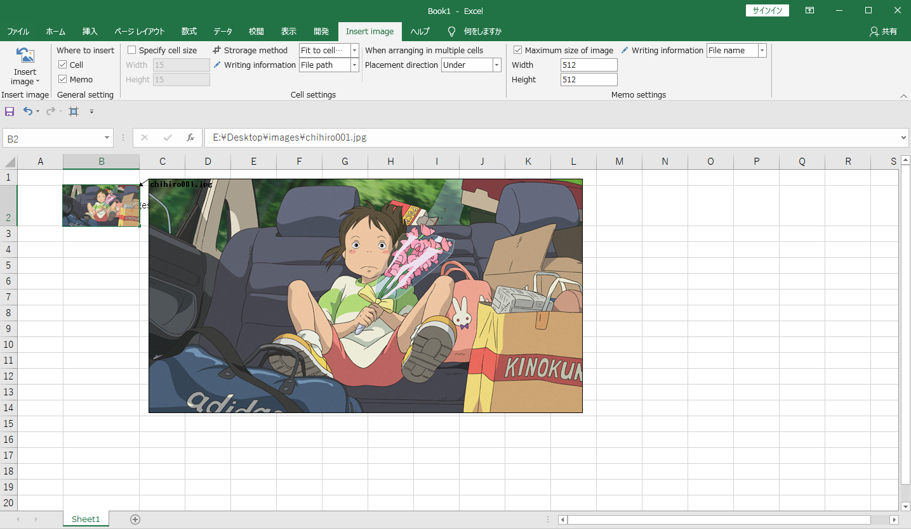

- [日本語版](/docs/README_JP.md)

This is an Excel add-in that inserts images into cells and notes.

## Overview
When using Excel, it takes time to paste the image to fit the cell and resize it.This add-in can optimize the size of cells and images and arrange them as you want in a short time.

## Demo

## Environment

.NET Framework 4.8

### Note

1. After processing with this add-in, "Undo (Ctrl + Z)" operation is not possible. Please save the file in advance.
1. If you select "Fit to cell height" as the storage method, the width of the cell and the image may not match.

## Install

1. Double-click "setup.msi" to install
1. Open Excel and check that "Insert Image" is displayed on the ribbon.

\* If not displayed
1. Open "File> Options> Ribbon Preferences"
1. Check "Insert image"

## Uninstall

1. Open "Control Panel> Apps"
1. Select "ImageInserter_ExcelAddin" and click "Uninstall"

## License

[MIT](./LICENSE)
