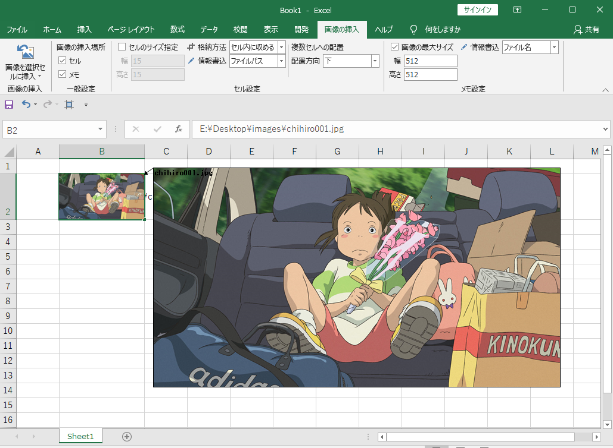

- [In English](../README.md)

画像をセルやメモに挿入するExcelアドインです。

## 概要
Excel上でセルに収まるように一枚ずつ画像をリサイズする作業は時間が掛かります。本アドインを利用することで、セルのサイズや画像のサイズを変えて短時間で思い通りに配置することができます。

## デモ

## 環境

.NET Framework 4.8

### 注意

1. 本アドインで処理を行った後、操作を元に戻す（Ctrl+Z）ことはできません。事前にファイルを保存しておいてください。
1. 格納方法で「セル高さに合わせる」を選択した場合、セルと画像の幅が異なる可能性があります。

## インストール

1. 「setup.msi」をダブルクリックしてインストールする
1. Excelを開いて、リボンに「画像の挿入」が表示されていることを確認する

※ 表示されない場合
「ファイル＞オプション＞リボンのユーザー設定」から「画像の挿入」にチェックを入れる

## アンインストール

1. 「コントロールパネル＞アプリ」を開く
1. 「ImageInserter_ExcelAddin」を選択して「アンインストール」をクリック

## ライセンス

[MIT](../LICENSE)
